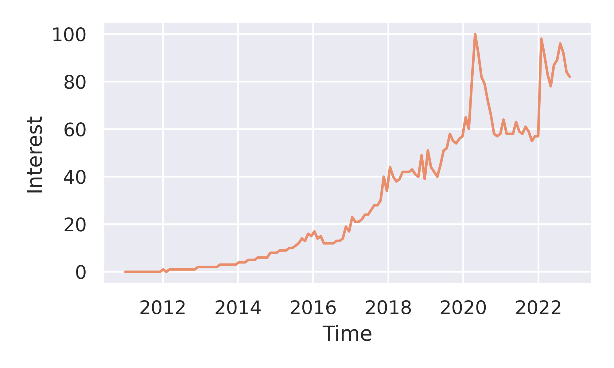

# Udemy courses price choice

## An analysis of the courses' price distribution in Udemy

Technologies:

* Python
  * Pandas
  * Seaborn
  * Matplotlib
* SQL
* GCP (Google Cloud Platform)
* BigQuery
* Google Trends

Data coutersy from Hossain, available at Kaggle ([here](https://www.kaggle.com/datasets/hossaingh/udemy-courses?select=Course_info.csv)) under the CC BY-NC-SA 4.0 license  
Data coverage from Jan 01 2011 to Oct 10, 2022.

## Abstract

Udemy is a Massive Open Online Course (MOOC) platform. On Oct 10, 2022, it provided available more than 200,000 online courses (free and paid) in 13 different categories and 79 languages. The website counts on more than 73,000 instructors, which are users who provide their content online and may charge the subscribers for that. Since the number of udemy subscribers has been increasing rapidly during the past years, the number of people selling courses follows the same tendency.

* The question is: if you are a content creator, regardless of the category, how to decide the correct course price which will return the higher profit? This work tries to help this decision based on the current courses hosted on the website and their expected income.

### Market tendency
Google searches for 'udemy' has been increasing dramatically since 2011. The figure below shows the Google Trends for the word 'udemy' worldwide from 2011 to 2022.

### Price distribution

About 10% of all Udemy courses are free, and the vast majority of the paid courses cost below $200. The distribution shows, actually, that most of the courses are between $0 and $50. 

Furthermore, approximately 59% of the courses' content is taught in English, followed by Portuguese, Spanish, Turkish, and Japanese.

### How likely is it for a subscriber to enroll in a course depending on the price?

To answer this question, we have to create a figure of merit:
Naturally, for courses in a given price range (eg. between $ 50 and $ 70), the total number of subscribers increases with the number of courses in the same price range. Therefore, a good quantity to measure is the normalized number of subscribers (per number of courses), both at a given price.

For courses up to $20, the number of subscribers seems to grow with the course price. However, above this value, the courses tend to have fewer subscribers.

### What are the courses' prices that return the higher income?

We can calculate the average profit of a course for a given price by multiplying the price times the average number of subscribers as above.

For courses up to $20, the higher the price, the higher the profit. However, above this value, the uncertainty grows rapidly, and the prediction is compromised. A $100 course can make the same profit as a $1 course. Naturally, the course 'success' now depends on many other factors, like the subject, instructor, and even its title.

### Does this means creating longer courses?

An interesting observation is that expensive courses do not necessarily have more content length. 

## Conclusions

The data shows that a $20-course will make more profit than a $1-course because more people tend to subscribe to the former. However, as the course prices increase to values above $20, the uncertainty in profit increases, and eventually a $100-course can even make less profit than a $1-course. Despite the price, the time duration does not change significantly in the price range between $0 and $1000.
